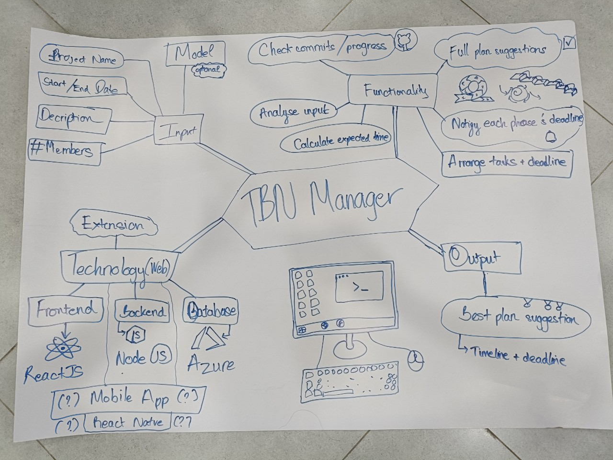
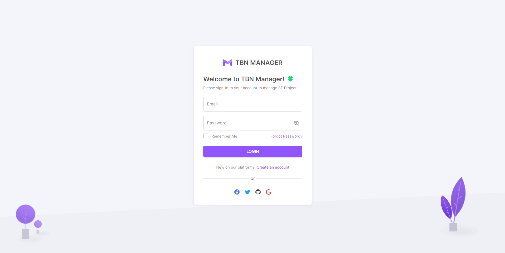
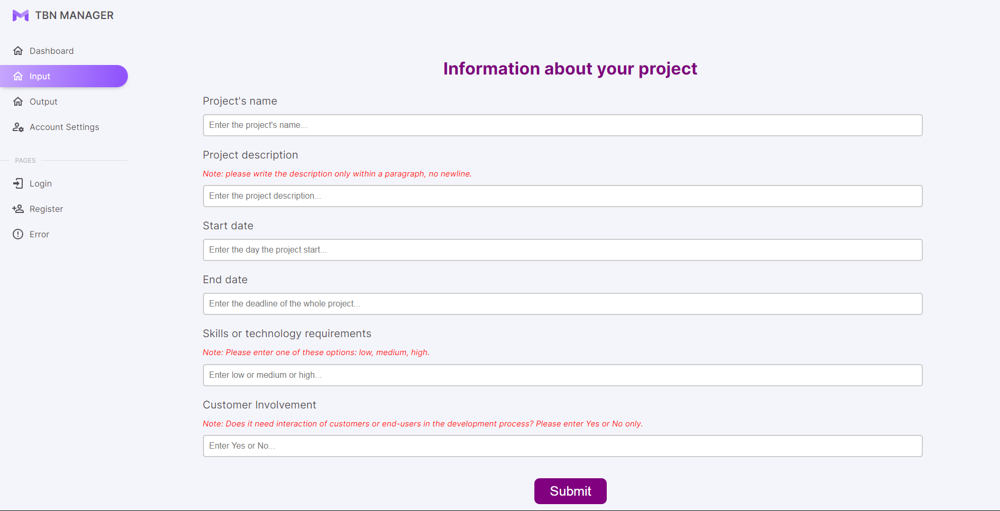
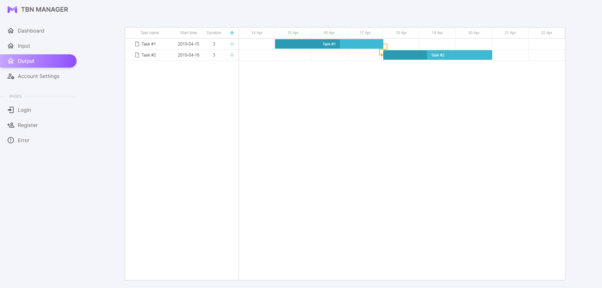

# TBN Manager

## Introduction
Developers need the Developer Project Management Tool for several reasons, all of which are aimed at improving their efficiency, collaboration, and overall project success. TBN Manager is a web-based application to suggest the developers plan the projects in software engineering efficiently. 

## Idea 

## Target users:
- Freelance developers / developers working in company
- Developers working on individual projects / developers working in team.

## Benefits:
- Help developers manage their time in the projects efficiently.
- Help developers concentrate on the fundamental tasks.
- Help developers choose the suitable software process model for their project.

## Functionalities
- Suggest suitable software process model: waterfall, agile, incremental.
- Suggest tasks and classify into phases in software process based on the project description.
- Suggest a plan with timeline for each task in the project.
- Arrange which tasks should be done first based on the priority of each task.
Notify the developers about the upcoming deadline.

## Demonstration
- 
- 
- 
